# Hangman

Hangman is a game usually played by two or more people, where one person thinks of a word while the others guess what the word is by guessing one letter at a time until the whole word is revealed.
For this project I wanted to create a version of this game that you can play against the computer rather than playing against another person.
This is done by using python to generate the word and check if the user's guesses are correct, incorrect, invalid or if the user has already guessed the letter.

[Click here to go to the live website!](https://iankanehangman.herokuapp.com/) 

## Table of contents 

1. [Plans and structure](#plans-and-structure)
    - [Objectives](#objectives)
    - [Changes throughout the process](#changes-throughout-the-process)
2. [Features](#features)
    - [Game Menu](#game-menu)
    - [Game](#game)
    - [Losing message](#losing-message)   
    - [Winning message](#winning-message) 
    - [Extra features](#extra-features)
3. [Testing](#testing)
    - [Python](#python)
    - [Manual Testing](#manual-testing)
    - [Bugs](#bugs)
4. [Deployment](#deployment)
5. [Finished product](#finished-product)
6. [Credits](#credits)

## Plans and structure 

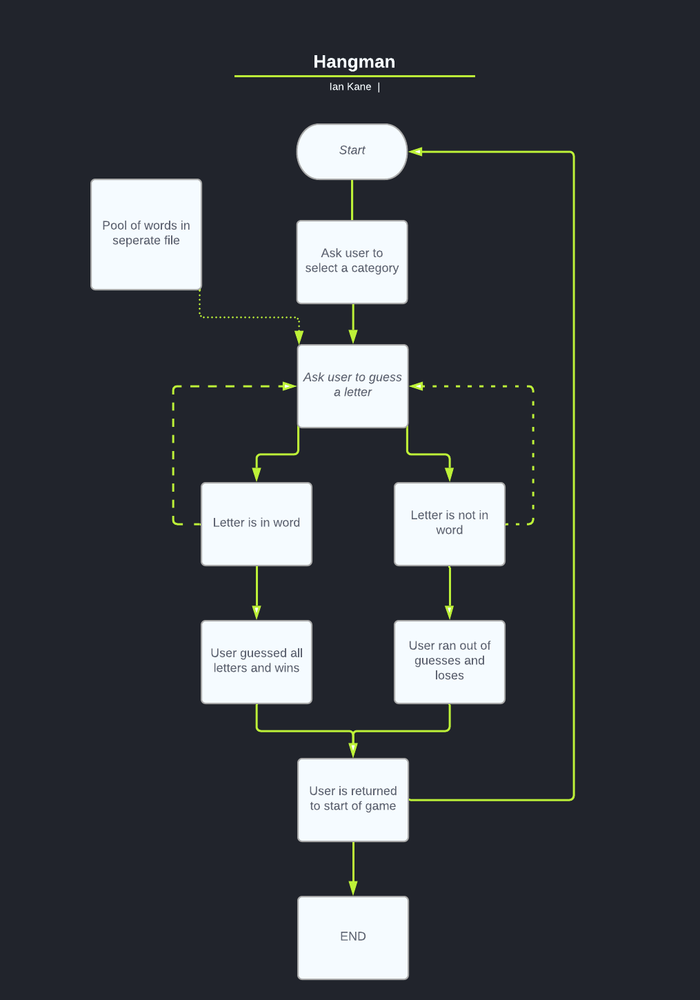  

### Objectives

- I want to create a game that is easy to navigate. 
    - Was this achieved?
        - Yes
    - How was this achieved?
        - This was achieved by creating three categories for user to choose from.
                        
 - I want the game to run in a smooth loop to allow the user to keep playing as many times as they'd like to. 
    - Was this achieved?
        - Yes
    - How was this achieved?
        - If a user either loses or wins the game it will take them to game menu where they can choose another category.

- To make it clear to the user how many tries they have left until the game is over.
    - Was this achieved?
        - Yes
    - How was this achieved?
        - When the user gets a guess wrong the characters will print out the traditional hangman image. The user will also know what letters they have selected below image. Reselecting the same letter in error will not result in fail.

### Changes throughout the process

Throughout the process of making this project I decided to change a couple of things due to the time limit I had to make the game. 

- Originally, I planned to have difficulty settings where user could select easy, medium or hard. I opted to keep it simple and instead use three category options.

I decided that this idea was not as important as all the other functions so I would like to either implement them if I have time to at the end of the process or if not, I would like to implement them in the future so I can continue to use this game with family and friends. 

Go back to [Table of contents](#table-of-contents)

## Features 

### Game Menu
- This is the first page you see when the app loads. On this page you will be presented with three options. Select options 1 - 3 and user will be brought to relevant page. Select an incorrect charcater and messages "No such topic" will display.
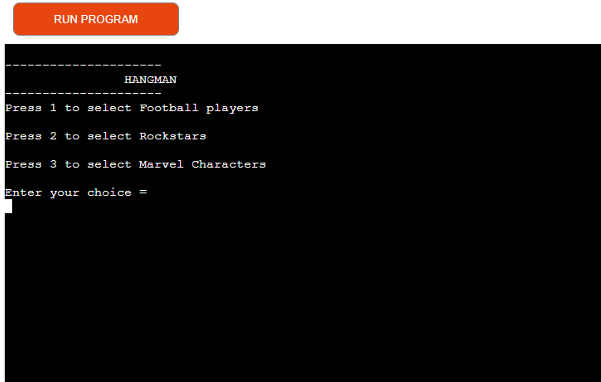

### Game
- When the user has selected a category they will be shown a pre hangman image as well as an empty space for word. Incorrect character selections will also be displayed upon selection.
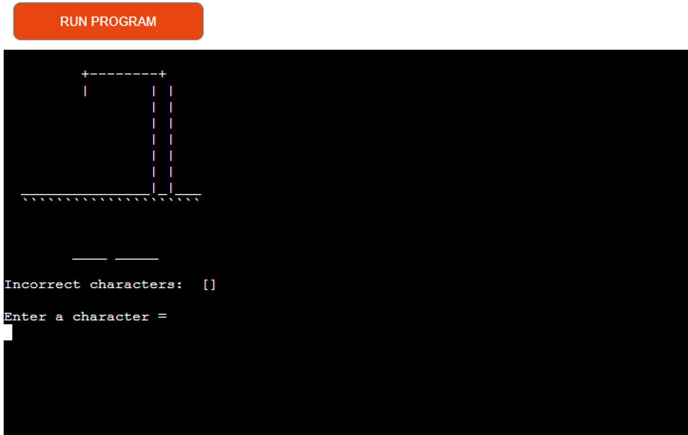

### Losing message
- If a user runs out of guesses they will be shown game over message with instuctions to play again. Correct answer will also be displayed. Hangman image will de displayed as user guesses incorrect characters.
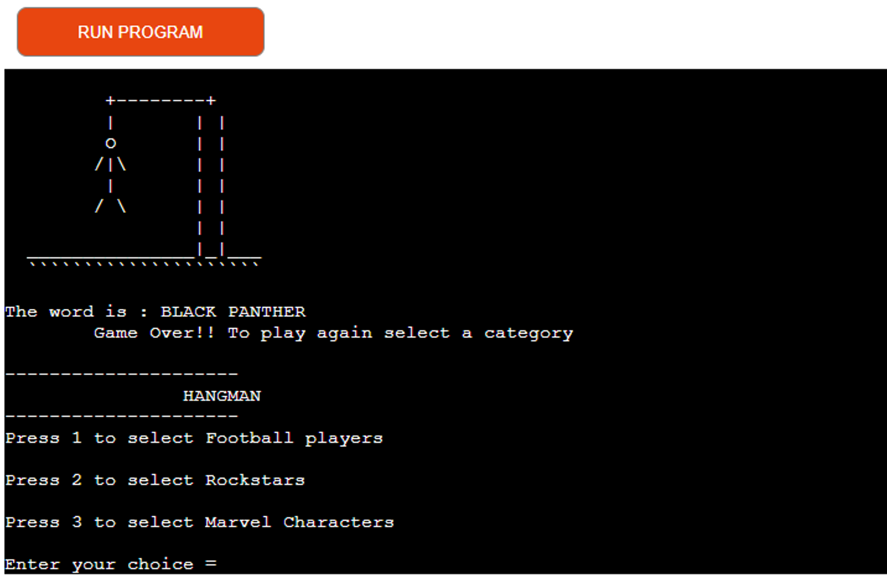

### Winning message
- If the user guesses all letter correctly they will be congratulated with instuctions to play again.
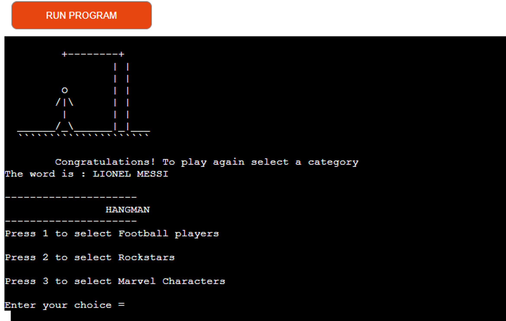

### Potential features to add in future
- I would like to return to this project and add a welcome page as well as difficulty settings. 

Go back to [Table of contents](#table-of-contents)

## Testing

### Python
Python was tested using PEP8 [PEP8 validator](http://pep8online.com/) 

The Python results came back with the following:

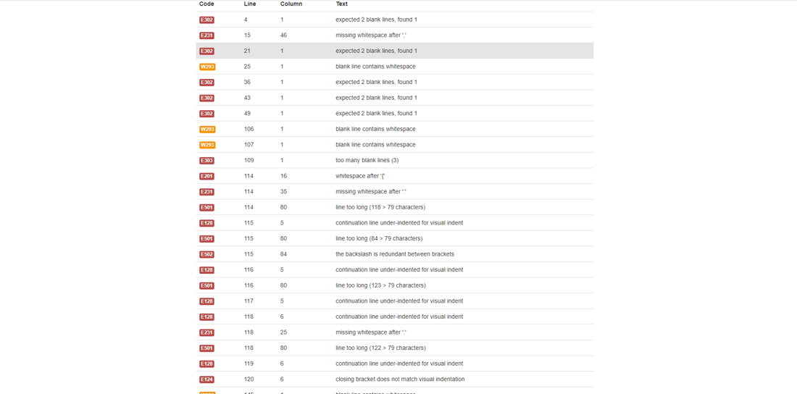

- numerous blank line errors and whitespace errors which were fixed using beautifier.

- line 114 - 118 were fixed bu creating a seperate word file and stacking words. See below:

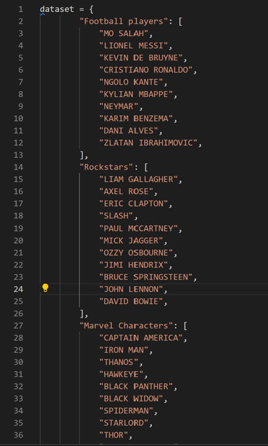

- I then retested with PEP8 and it came back clear:
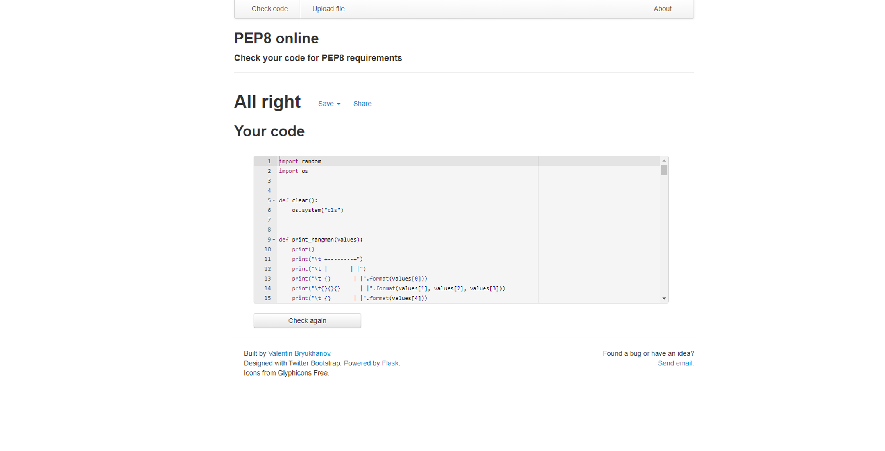 

### Manual Testing 

1. Game menu appears

 - First, I tested what would happen if the user typed anything other than 1 - 3: Error message shows, results were as expected. See below:

 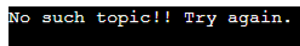 

 - Next I tested what would happen if the user typed 1 - 3: results were as expected. All three options takes user to game.

 - Next I tested what would happen if user correctly guessed a character, results were as expected. See below:

 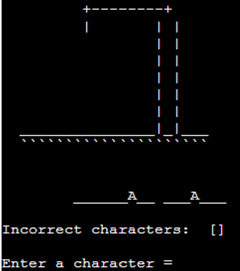 

 - Next I tested what would happen if user incorrectly guessed a character, results were as expected. See below:

  

 - Next I tested what would happen if user guessed the word correctly, and if correct display message appeared. 
 results were as expected. See below:

 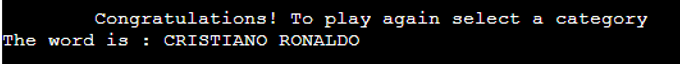 

 - Lastly I tested what would happen if user guessed the word incorrectly, and if correct display message appeared. 
 results were as expected. See below:

 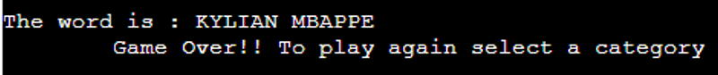 

