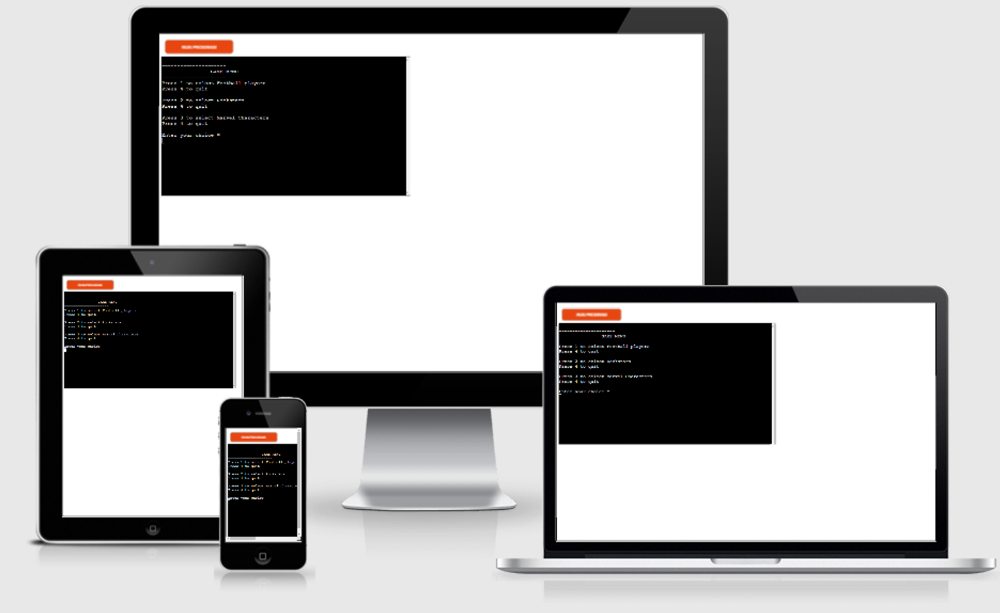
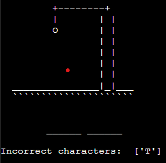

# Hangman

Hangman is a game usually played by two or more people, where one person thinks of a word while the others guess what the word is by guessing one letter at a time until the whole word is revealed.
For this project, I wanted to create a version of this game that you can play against the computer rather than playing against another person.
This is done by using python to generate the word and check if the user's guesses are correct, incorrect, invalid or if the user has already guessed the letter.

[Click here to go to the live website!](https://iankanehangman.herokuapp.com/) 

## Table of contents 

1. [Plans and structure](#plans-and-structure)
    - [Objectives](#objectives)
    - [Changes throughout the process](#changes-throughout-the-process)
    - [Libraries used](#libraries-used)
2. [Features](#features)
    - [Game Menu](#game-menu)
    - [Game](#game)
    - [Losing message](#losing-message)   
    - [Winning message](#winning-message) 
    - [Extra features](#extra-features)
3. [Testing](#testing)
    - [Python](#python)
    - [Manual Testing](#manual-testing)
    - [Bugs](#bugs)
4. [Deployment](#deployment)
5. [Finished product](#finished-product)
6. [Credits](#credits)

## Plans and structure 

  

### Objectives

- I want to create a game that is easy to navigate. 
    - Was this achieved?
        - Yes
    - How was this achieved?
        - This was achieved by creating three categories for the user to choose from.
                        
 - I want the game to run in a smooth loop to allow the user to keep playing as many times as they'd like to. 
    - Was this achieved?
        - Yes
    - How was this achieved?
        - If a user either loses or wins the game it will take them to the game menu where they can choose another category.

- To make it clear to the user how many tries they have left until the game is over.
    - Was this achieved?
        - Yes
    - How was this achieved?
        - When the user gets a guess wrong the characters will print out the traditional hangman image. The user will also know what letters they have selected below the image. Reselecting the same letter in error will not result in a fail.

### Changes throughout the process

Throughout the process of making this project, I decided to change a couple of things due to the time limit I had to make the game. 

- Originally, I planned to have difficulty settings where the user could select easy, medium, or hard. I opted to keep it simple and instead use three category options.

I decided that this idea was not as important as all the other functions so I would like to either implement them if I have time to at the end of the process or if not, I would like to implement them in the future so I can continue to use this game with family and friends. 

### Libraries used

1. ## Random
- The above was used to generate a random word from dataset of the chosen topic.

2. ## OS
- The OS module provided functions for interacting with the operating system.

Go back to [Table of contents](#table-of-contents)

## Features 

### Game Menu
- This is the first page you see when the app loads. On this page, you will be presented with three options. Select options 1 - 3 and the user will be brought to the relevant page. Select an incorrect character and the message "No such topic" will display.

### Game
- When the user has selected a category they will be shown a pre hangman image as well as a space for word. Incorrect character selections will also be displayed upon selection.

### Losing message
- If a user runs out of guesses they will be shown the game over message with instructions to play again. The correct answer will also be displayed. Hangman image will de be displayed as the user guesses incorrect characters.

### Winning message
- If the user guesses all letters correctly they will be congratulated with instructions to play again.

### Potential features to add in future
- I would like to return to this project and add a welcome page as well as difficulty settings. 

Go back to [Table of contents](#table-of-contents)

## Testing

### Python
Python was tested using PEP8 [PEP8 validator](http://pep8online.com/) 

The Python results came back with the following:

- numerous blank line errors and whitespace errors were fixed using beautifier.

- line 114 - 118 was fixed by creating a separate word file and stacking words. See below:

- I then retested with PEP8 and it came back clear:
 

### Manual Testing 

1. Game menu appears

 - First, I tested what would happen if the user typed anything other than 1 - 3: Error message shows, results were as expected. See below:

  

 - Next, I tested what would happen if the user typed 1 - 3: results were as expected. All three options take the user to the game.

 - Next, I tested what would happen if the user correctly guessed a character, results were as expected. See below:

  

 - Next, I tested what would happen if the user incorrectly guessed a character, results were as expected. See below:

  

 - Next, I tested what would happen if the user guessed the word correctly and if the correct display message appeared. 
 results were as expected. See below:

  

 - Lastly, I tested what would happen if the user guessed the word incorrectly and if the correct display message appeared. 
 results were as expected. See below:

  

 ### Bugs 
 1. Only bug I can across was when selecting the same character the display message "Already tried" didn't display long enough and can barely read it although it is displaying. Due to time limitations, I did not rectify this as it didn't affect the game.

 Go back to [Table of contents](#table-of-contents)

 ## Deployment 

There were many steps to deploying this project to Heroku:

1. If I had installed any packages to Gitpod, I would need to add them to a list of requirements. 
- To do this I would have typed pip3 freeze > requirements.txt and hit enter, this would update the requirements.txt file.
- I'd need to commit and push this to Github.
- Heroku will use this list to install the dependencies into the application before the project is run.
- However, I didn't need to do this as I had no packages installed.
2. I went over to my Heroku dashboard and clicked on 'create a new app'.
3. I chose a name for my app; every app must have a unique name so I couldn't call it hangman as this was already taken so I went for iankanehangman.
4. Selected my region and clicked create the app. 
5. I then went to the tab at the top of the page and clicked on settings. 
6. Some apps will include sensitive data in the gitpod workspace that isn't in the github repository because it has been deliberately protected in the gitnore.file. I didn't have any sensitive data to protect but if I had done, I would have needed to create a config var to allow Heroku access to this data. 
 - To do this, I would have clicked reveal config vars.
7. I added the buildpacks needed by clicking on the buildpack button.
 - Here I selected python and pressed save changes.
 - Then repeated the same process but selected nodejs this time.
 - making sure it was done in that order with python at the top and nodejs under.
8. I scrolled back up to the tab at the top and clicked deploy.
9. I selected github as the deployment method and clicked connect to github.
10. Once this is selected, I then searched for my github repository name, and connected it to the correct repository.
11. Then I scrolled down, here there were two options.
 - The first option is to enable automatic deployment, which means that Heroku will rebuild the app every time I pushed a change to github.
 - The other option is to manually deploy, which is the choice I went for with this project.
12. When all the code is received from github there is a view button that is a link to the running app, I clicked this to make sure everything was running as expected.

Go back to [Table of contents](#table-of-contents)

## Finished product

Game Menu

Game Page

Game Over

Game Win

Go back to [Table of contents](#table-of-contents)

## Credits 

- [Lucid chart](https://www.lucidchart.com/pages/) - This was used to create the flow chart in the planning process for this project. 
- [code beautifier](https://codebeautify.org/python-formatter-beautifier) - Helped make the code look neat.
- [PEP8 validator](http://pep8online.com/) - was used to check the code was valid.
- [Gramarly](https://app.grammarly.com/) - Ran Readme through grammar checked
- Youtube - I watched many different youtube videos on how to make hangman using python and learned a lot from many people.
- Marcel - Thanks to my mentor Marcel for his guidance through this project. 

Go back to [Table of contents](#table-of-contents)
